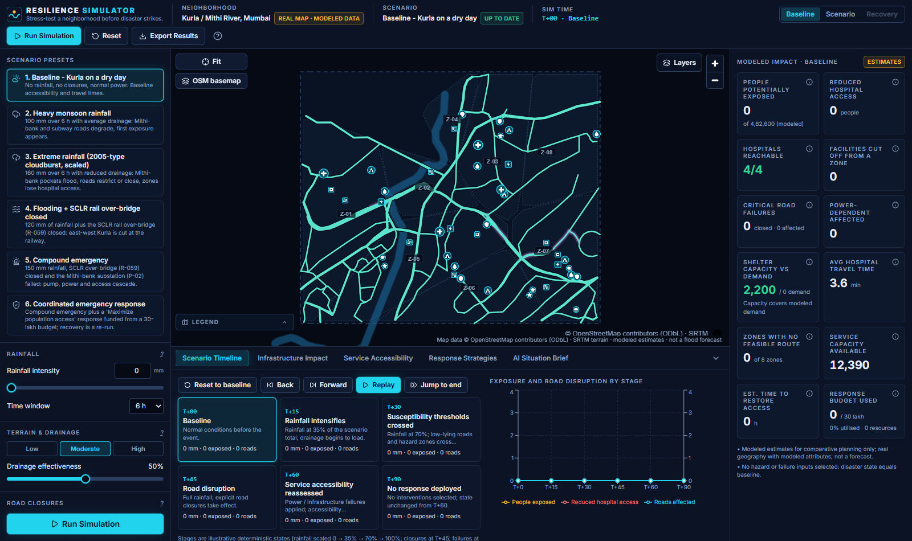
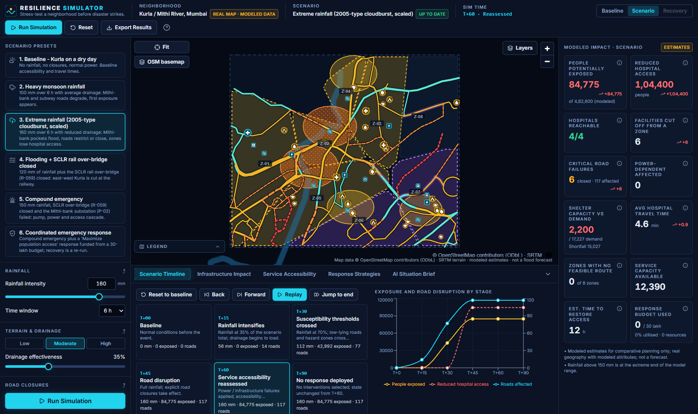
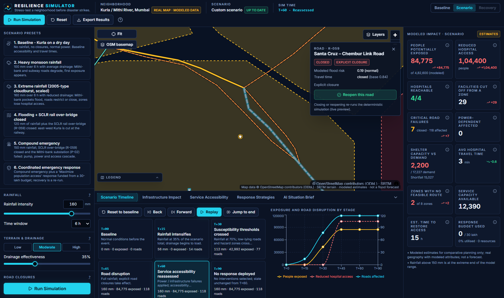
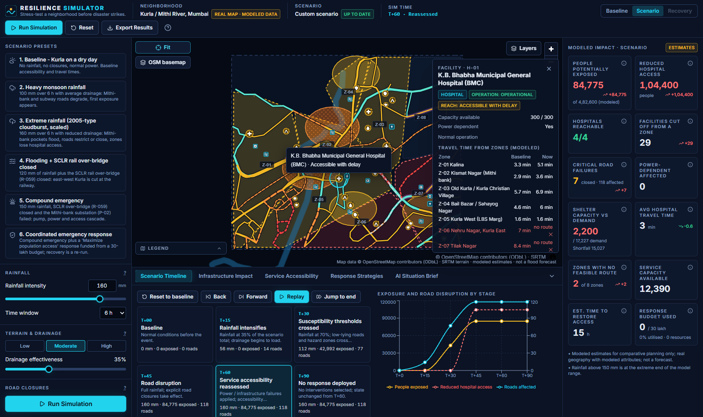
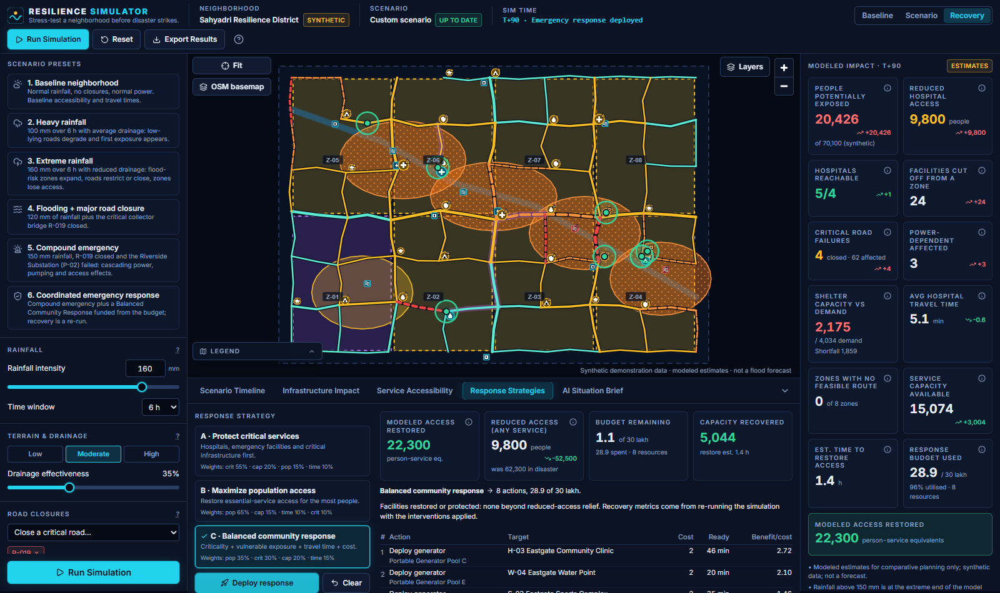
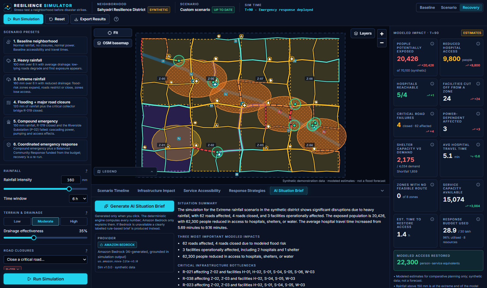
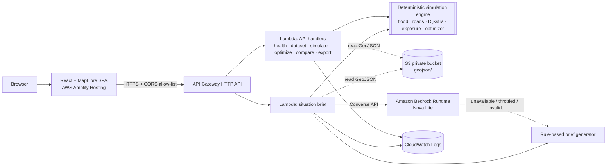

# RESILIENCE SIMULATOR

> **Stress-test a neighborhood before disaster strikes.**
> Simulate climate emergencies. Discover critical failures. Test response strategies. Build resilience before the next extreme event.
>
> **Now on real geography: Kurla and the Mithi River, Mumbai (BMC Ward L)** - OpenStreetMap roads, bridges and facilities, SRTM terrain.

An interactive, neighborhood-scale **climate emergency digital twin** of Kurla, Mumbai - a Mithi River neighbourhood badly hit by the 26 July 2005 deluge (944 mm in 24 h) - for community resilience groups, disaster volunteers, students and ward-level planners. Change rainfall, close roads, knock out power, and watch a deterministic engine recompute flooding, road disruption, hospital/shelter/water accessibility, population exposure, critical bottlenecks, and the measurable benefit of a budget-constrained response plan. Amazon Bedrock then explains the results in a grounded situation brief.

| | |
|---|---|
| **Live app (Amplify)** | https://main.dxhzlkmrgksnx.amplifyapp.com |
| **Live API** | https://4wbvz70w98.execute-api.us-east-1.amazonaws.com/api/v1/health |
| **Region / account** | us-east-1 (AWS CLI profile `hackathon`) |
| **Category / lane** | `#social-good` (climate resilience) · `#community` |
| **Coding agent ↔ AWS proof** | [docs/AWS_AGENT_CONNECTION_PROOF.md](docs/AWS_AGENT_CONNECTION_PROOF.md) (CloudTrail events tagged `app/cortex-code-agent`) |

> **Data provenance:** roads, Mithi River crossings, flyovers, the river and 29 facility locations are **real** (© OpenStreetMap contributors, ODbL 1.0); terrain is **SRTM 30 m**; zone populations are scaled from **Census 2011 Ward L density**. Populations per zone, capacities, backup power, power links, 5 of 6 pumps, 3 of 4 power nodes and response resources are **modeled planning assumptions**, not official BMC data. Results are *modeled estimates for comparative planning and tabletop drills* - **not** a flood forecast and **not** an operational emergency-management system.



## Contents
1. [Problem](#1-problem-statement) · 2. [Features](#2-features) · 3. [Screenshots](#3-screenshots) · 4. [Architecture](#4-architecture) · 5. [Stack](#5-technology-stack) · 6. [Data model](#6-data-model) · 7. [Methodology](#7-simulation-methodology) · 8. [Metrics](#8-metric-definitions) · 9. [Assumptions & limits](#9-known-assumptions-and-limitations) · 10. [Local dev](#10-local-development) · 11. [AWS deployment](#11-aws-deployment) · 12. [Bedrock](#12-bedrock-configuration) · 13. [Testing](#13-testing) · 14. [Demo](#14-demo-walkthrough) · 15. [Cost](#15-cost-conscious-design) · 16. [Teardown](#16-cleanup-and-teardown)

## 1. Problem statement
Extreme rainfall rarely fails a neighborhood through one dramatic event - it fails through **cascades**: a flooded bridge cuts the only route to a clinic, a substation outage stops the pump that was keeping a road dry, and shelter capacity sits on the wrong side of the river. Kurla is a textbook case: the Mithi River runs down its west side, the Central Railway line splits it east from west, and a handful of bridges and rail over-bridges decide whether ~480,000 modeled residents can reach a hospital. Community groups, volunteers and students need a free, explorable way to ask *"what breaks first, who loses access, and where does the next rupee of response help most?"* before the monsoon, not during it.

**Measured on the Kurla model (deterministic, reproducible):** closing the Santa Cruz - Chembur Link Road rail over-bridge under 120 mm of rain leaves **104,400 residents of Nehru Nagar and Tilak Nagar without timely hospital access**; in the compound emergency (150 mm + over-bridge closed + Mithi-bank substation down) **206,400** residents lose access to at least one essential service, and a 30-lakh *Maximize population access* plan brings that to **0** in the re-run model.

## 2. Features
- **Interactive MapLibre map** of roads, flood-risk zones, population zones, hospitals, shelters, schools, emergency posts, water points, power/drainage assets, staging depots - with layer toggles, legend, hover tooltips, click inspector, fit-to-bounds, optional OSM basemap.
- **Deterministic simulation engine**: rainfall + duration + drainage + susceptibility → flood-risk index → Open / Degraded / Restricted / Closed roads → Dijkstra re-routing → accessibility, exposure, power cascade.
- **Click-to-close roads** with live re-simulation; power/pump/facility failure toggles.
- **Critical-bottleneck analysis**: every traversable road is removed in turn to score population-weighted service-access loss; selecting one highlights affected zones and facilities.
- **Three response strategies** (Protect critical services / Maximize population access / Balanced community) solved by a transparent greedy benefit-to-cost optimizer that **re-runs the engine** to score candidates and to compute recovery.
- **Baseline vs Disaster vs Recovery** comparison (table + charts) and a **6-stage timeline** (T+00 … T+90) with step/back/replay/jump controls.
- **AI Situation Brief** via Amazon Bedrock with ID-grounding validation, and a clearly labelled **rule-based fallback**.
- **Export**: JSON report, CSV summary, printable HTML, plus a shareable/importable scenario config.
- Accessible (keyboard, labels, text+shape+pattern status cues), responsive, graceful error/empty/loading states.

## 3. Screenshots
| Extreme rainfall | Road closure → re-route |
|---|---|
|  |  |
| **Hospital inspector (baseline vs now, alternative route)** | **Recovery after Balanced response** |
|  |  |



## 4. Architecture

Details: [docs/ARCHITECTURE.md](docs/ARCHITECTURE.md). **Deterministic:** everything except the prose in the Bedrock brief. **AI-generated:** only the wording of the brief, and only after the facts are computed; its output is validated and falls back to deterministic text if it cites anything not in the facts.

## 5. Technology stack
Frontend: React 18, TypeScript (strict), Vite, Tailwind CSS, shadcn/ui-style primitives (Radix), Lucide, MapLibre GL JS, Recharts, Zustand, Zod. Backend: Python 3.12 Lambda, Pydantic v2, boto3 (Bedrock Runtime, S3), API Gateway HTTP API. Infra: AWS SAM (`template.yaml`) + AWS Amplify Hosting. Deviations: none from the brief; the SAM Lambda bundle is built by `scripts/build_lambda.py` (Linux wheels) so Windows/macOS builds work without Docker.

## 6. Data model
Pydantic models (`backend/src/models`) and matching TypeScript interfaces (`frontend/src/types`): `RoadSegment`, `Facility`, `PopulationZone`, `HazardZone`, `EmergencyResource`, `PowerNode`, `DrainageAsset`, `Scenario`, `Intervention`, and the simulation result blocks. Dataset `kurla-mithi-osm-1.0`, built deterministically by `backend/src/data/build_kurla_dataset.py` from cached OSM + SRTM extracts in `backend/data_sources/` (`--refresh` re-downloads): **150 road segments (5 Mithi crossings, 13 flyover / rail over-bridge segments) on 105 junctions, 8 real neighbourhoods (~482,600 modeled residents), 4 hospitals incl. K.B. Bhabha Municipal General Hospital, 6 shelters, 8 schools, 5 police / fire posts, 6 water points, 4 power nodes (Tata Power Kurla Receiving Station + 3 modeled) + 6 drainage pumps (BMC Kalina pumping station + 5 modeled), 6 Mithi-bank / nala flood pockets, 5 staging depots, 7 resource pools, the Mithi River and the study-area boundary.** Every feature carries its OSM id or a `source: modeled` flag. The original synthetic generator is kept as `generate_demo_data.py` (legacy).

## 7. Simulation methodology
Summary (full detail in [docs/SIMULATION_METHODOLOGY.md](docs/SIMULATION_METHODOLOGY.md)):
```
flood_risk = clamp( rainfall_intensity_factor × susceptibility × (1 − drainage_effectiveness) × exposure × GAIN , 0, 1 )
```
Classes: Normal `<0.25` · Watch · Flood risk `≥0.50` · Impassable `≥0.75` (configurable, bridges get a +0.12 margin). Road state: Watch→Degraded (×1.3 time), Flood risk→Restricted (×2.5), Impassable or explicit closure→Closed (removed from the graph). Accessibility uses network travel time to the best *operating* facility; operational status (power/backup) is tracked separately from reachability. Recovery = re-run with interventions applied.

## 8. Metric definitions
Each metric has an in-app tooltip (sourced from `backend/src/simulation/metrics.py`) and is listed in [docs/SIMULATION_METHODOLOGY.md](docs/SIMULATION_METHODOLOGY.md#metric-definitions). Facility counts and zone/people counts are always reported separately; a zone's population is counted once per metric.

## 9. Known assumptions and limitations
See [docs/ASSUMPTIONS_AND_LIMITATIONS.md](docs/ASSUMPTIONS_AND_LIMITATIONS.md). Headlines: real OSM geography but modeled populations, capacities and infrastructure links; uncalibrated conceptual flood index (not validated against 2005 / 2017 flood extents); simplified road graph; uniform population density within zones; simplified power dependency; no rescue-team/evacuation modelling; single-instance demo without persistence.

## 10. Local development
Prereqs: Node 18+, Python 3.12.
```powershell
# Backend tests + local API (no AWS needed; Bedrock disabled -> rule-based brief)
python -m venv .venv; .venv\Scripts\activate; pip install -r backend/requirements-dev.txt
python backend/src/data/build_kurla_dataset.py        # optional: rebuilds identical Kurla GeoJSON from cached OSM/SRTM
python -m pytest backend -q
python backend/src/handlers/local_server.py           # http://127.0.0.1:8787/api/v1/health

# Frontend
cd frontend; npm install
copy .env.example .env.local                           # VITE_API_BASE_URL=http://127.0.0.1:8787
npm run dev                                            # http://localhost:5173
npm test ; npm run build
```
To use Bedrock locally: `$env:ENABLE_BEDROCK="true"; $env:AWS_PROFILE="hackathon"` before starting the local server.

## 11. AWS deployment
One command (details and manual steps in [docs/DEPLOYMENT.md](docs/DEPLOYMENT.md)):
```powershell
pwsh scripts/deploy.ps1 -Profile hackathon -Region us-east-1 [-AmplifyAppId <existing id>]
```
It creates/updates: API Gateway HTTP API, two Python 3.12 Lambdas, a private encrypted S3 bucket, CloudWatch log groups, IAM roles (least privilege), the Amplify app (manual deployment, security headers incl. CSP), uploads GeoJSON, builds the SPA with `VITE_API_BASE_URL`, and runs `scripts/smoke_api.py`. No access keys are stored anywhere.

## 12. Bedrock configuration
Parameters `EnableBedrock`, `BedrockModelId`, `BedrockBaseModelId` (template) map to env vars `ENABLE_BEDROCK`, `BEDROCK_MODEL_ID`. Default `us.amazon.nova-lite-v1:0` (verified available in us-east-1 for this account). IAM allows only `bedrock:InvokeModel` on that foundation model and inference profile. Set `EnableBedrock=false` to run entirely on the rule-based fallback.

## 13. Testing
Executed in this repository (see [docs/AGENT_DEVELOPMENT_LOG.md](docs/AGENT_DEVELOPMENT_LOG.md) for dates/outputs):
- `python -m pytest backend` - **75 passed** (flood model, graph, accessibility, power cascade, optimizer constraints, recovery re-run, reconnection credit, determinism, API validation, Bedrock failure/fallback, invalid GeoJSON, data provenance, export).
- `npm test` (Vitest + Testing Library) - **47 passed** (store actions, API client, controls, closure interaction, run/loading/error states, strategy selection, recovery display, AI/fallback indicator, export/import).
- `scripts/smoke_api.py <api> <origin>` - 15/15 checks against the deployed API (incl. CORS, live Bedrock brief, fallback path, OSM provenance in exports).
- `scripts/e2e_flow.py <url>` - Playwright/Chrome run of the full 7-step demo against the deployed Amplify site on the Kurla data: 14/14 checks, zero console errors.
- `scripts/agent_proof.py` - regenerates the CloudTrail evidence table for the coding agent's AWS connection.

Final release (2026-10-02 17:35 UTC) via `pwsh scripts/deploy.ps1`: stack `UPDATE_COMPLETE`, Amplify job 7 `SUCCEED`, smoke 15/15, browser E2E 14/14.

## 14. Demo walkthrough
See [docs/DEMO_SCRIPT.md](docs/DEMO_SCRIPT.md) (90-second script).

## 15. Cost-conscious design
Serverless only, no database, no always-on compute. Bedrock is called only when the user clicks *Generate AI Situation Brief*; sliders never call it. API throttle 20 rps/40 burst. Lambda 1 GB, 25-29 s timeouts. API access-log retention 14 days. Expected demo cost is a few cents (requests, a handful of Nova Lite invocations, Amplify hosting/transfer).

## 16. Cleanup and teardown
```powershell
pwsh scripts/teardown.ps1 -Profile hackathon -AmplifyAppId <id>
```
Deletes the stack (API, Lambdas, bucket after emptying), the Amplify app. Lambda-created log groups `/aws/lambda/resilience-simulator-*` can be deleted manually.

## Repository layout
`backend/` (engine, handlers, tests) · `frontend/` (React app, tests) · `template.yaml` (SAM) · `infra/` (Amplify headers) · `scripts/` (build, deploy, smoke, E2E) · `docs/`.

## Who it is for (Community lane)
Built for the groups around the builder in Mumbai - tech meetups / AWS user groups that run civic-tech sessions, residents' associations and disaster-volunteer groups in flood-prone wards, and college classes studying urban climate resilience - as a free **tabletop-drill tool**: pick a monsoon scenario, find the single points of failure, argue about the response plan with numbers on the table. No sign-in, no install, runs in a browser. Nothing here claims real-world adoption yet; the next step is running one drill with each group and publishing what they changed.

## License / attribution
Hackathon demonstration code. **Map data © OpenStreetMap contributors, available under the Open Database License (ODbL 1.0)** - the derived GeoJSON in `backend/src/data/geojson/` is shared under the same licence. Terrain: SRTM 30 m (NASA/USGS, public domain) via OpenTopoData. Population density: Census of India 2011 (BMC Ward L). Optional raster basemap (off by default): © OpenStreetMap contributors, subject to the OSM tile usage policy.

