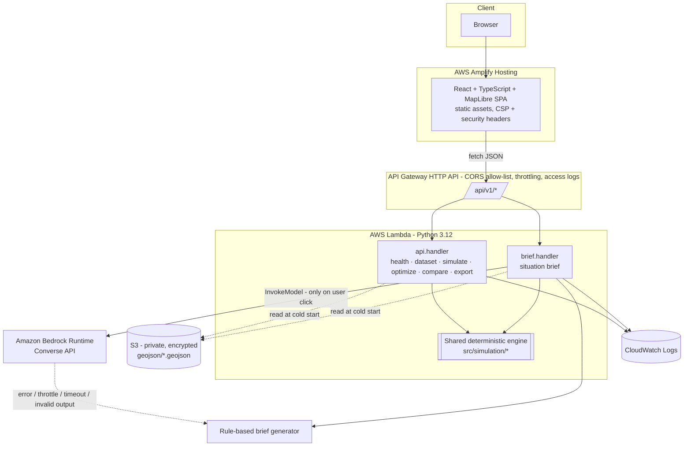

# Architecture

## Components
| Layer | Implementation | Notes |
|---|---|---|
| Hosting | AWS Amplify Hosting (manual deployment of the Vite build) | Custom headers: CSP (`connect-src` limited to the API domain + optional OSM tiles), HSTS, `X-Frame-Options: DENY`, nosniff, Permissions-Policy |
| API | API Gateway HTTP API | CORS origins = parameter `AllowedOrigins` (no wildcard); default route throttle 20 rps / burst 40; access logs to CloudWatch (14 d) |
| Compute | `ApiFunction` (`src.handlers.api.handler`), `BriefFunction` (`src.handlers.brief.handler`) | Both import the same engine package - calculations are never duplicated. The brief Lambda is separate so Bedrock permissions are isolated. 1024 MB, 25 s / 29 s |
| Data | Kurla GeoJSON (built from OpenStreetMap + SRTM by `build_kurla_dataset.py`) bundled + private S3 copy | `dataset.py` reads S3 (`GEOJSON_BUCKET`/`GEOJSON_PREFIX`) and falls back to the bundled copy; all layers validated (`GeoJSONError`) |
| AI | Bedrock Runtime `Converse` | Model id is a parameter; errors classified (`throttled`, `access_denied`, `model_unavailable`, `timeout`, `invalid_model_output`) and never leak payloads |
| Observability | CloudWatch Logs | Request bodies are **not** logged; unhandled errors log stack traces only |

## Request flows
1. **Load** - `GET /dataset` returns the GeoJSON layers, presets, strategies, resource catalog and default thresholds (~180 KB for Kurla). Then `POST /simulate` for the baseline preset.
2. **Simulate** - `POST /simulate {scenario}` → `run_scenario`: baseline eval (cached) → disaster eval → (optional) recovery eval with validated interventions → bottleneck scan → 6-stage timeline. Returns the three result blocks, comparison rows, timeline, bottlenecks, metric definitions, assumptions, warnings.
3. **Optimize** - `POST /optimize {scenario, strategy}` → greedy selection, each candidate scored by re-running the engine; returns the plan **and** a full simulation of the scenario with the plan applied (recovery).
4. **Brief** - `POST /brief {scenario}`: the server **re-runs the simulation** from the scenario (never trusts client-supplied numbers), builds a compact facts packet, calls Bedrock, validates JSON structure and that every identifier cited (`R-059`, `H-01`, `Z-02`…) exists in the facts; otherwise returns the deterministic fallback with `provider: "rule_based"` and a `fallback_reason`.
5. **Export** - `POST /export {scenario, format}` re-runs the simulation and renders JSON / CSV / HTML (data-provenance notice with OSM attribution, assumptions, limitations; no env values).

## Determinism boundary
| Deterministic (unit-tested) | AI-generated |
|---|---|
| Flood index, road states, graph routing, accessibility, exposure, power cascade, bottlenecks, optimizer, recovery, timeline, exports, rule-based brief | Only the *wording* of the Bedrock brief - and it is validated against the facts |

## Security
IAM roles only (no keys); Lambda policies: `S3ReadPolicy` on the one bucket, `bedrock:InvokeModel` on one foundation model + one inference profile (brief Lambda only); bucket is private (all public-access blocks, SSE-S3, bucket-owner-enforced); request body ≤ 64 KB; Pydantic bounds on every numeric input (rainfall 0-200 mm, duration 1-72 h, ≤60 closures…); client-supplied interventions are re-costed and re-validated server-side (budget, units, radius, reachability); consistent error envelope `{"error":{"code","message","details"}}`.

## Deployment audit trail
The release script sets `AWS_SDK_UA_APP_ID=cortex-code-agent`, so every CloudFormation, Lambda, S3 and Amplify call it makes is identifiable in AWS CloudTrail (`userAgent` contains `app/cortex-code-agent`). `scripts/agent_proof.py` extracts a masked evidence table; see `AWS_AGENT_CONNECTION_PROOF.md`.
